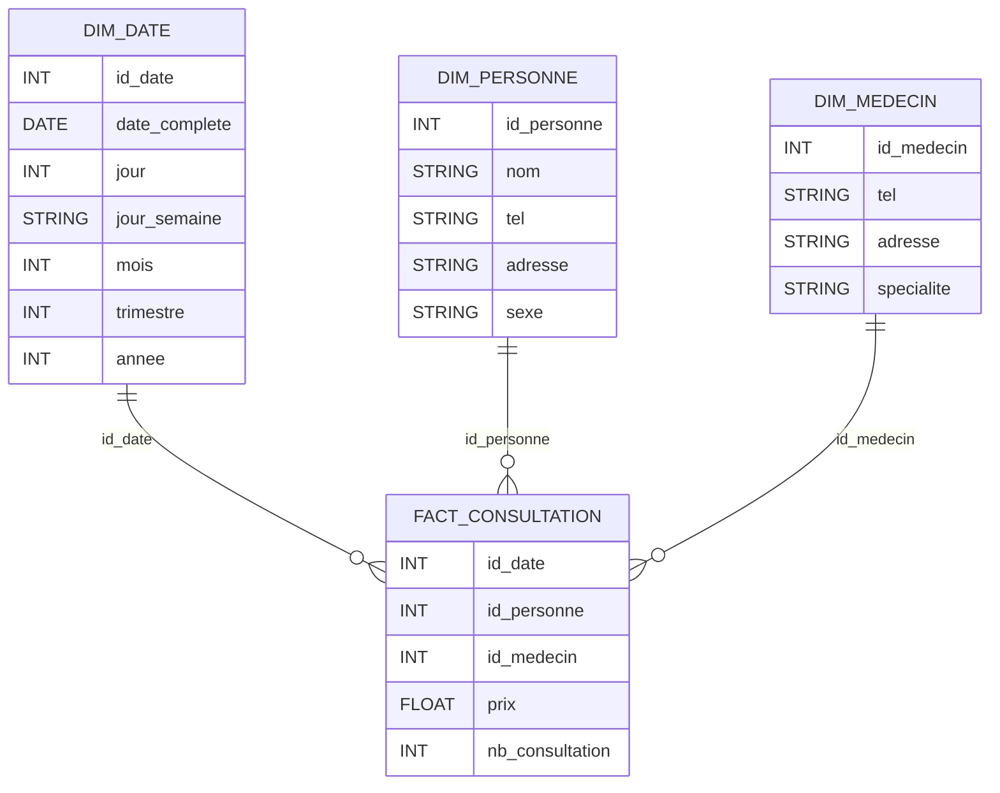

# Cas d’étude 1 — Consultations médicales

## Q1 — schéma relationnel



## Q2 — Quelle est la table des faits ?

👉 **La table des faits est :**

**`FACT_CONSULTATION`**

**Pourquoi ?**

* elle représente l’**événement métier central** : une consultation médicale ;
* chaque ligne correspond à **une consultation** ;
* elle porte les **mesures quantitatives** à analyser.

---

## Q3 — Quels sont les faits (mesures) ?

Les **faits** sont les **mesures numériques analysables**.

### Mesures retenues

| Mesure            | Type | Commentaire                          |
| ----------------- | ---- | ------------------------------------ |
| `prix`            | FLOW | coût de la consultation              |
| `nb_consultation` | FLOW | toujours égal à 1 (sert au comptage) |

👉 Le **nombre de consultations** se calcule par :

* `COUNT(*)`
  ou
* `SUM(nb_consultation)`

---

## Q4 — Combien de dimensions ont été retenues ? Quelles sont-elles ?

👉 **3 dimensions principales**

| Dimension      | Rôle                              |
| -------------- | --------------------------------- |
| `DIM_DATE`     | analyse temporelle                |
| `DIM_PERSONNE` | analyse par patient               |
| `DIM_MEDECIN`  | analyse par médecin et spécialité |

📌 La **spécialité** est un **attribut de la dimension Médecin** (pas une dimension séparée).

---

## Q5 — Quelles sont les hiérarchies des dimensions ? (dessin)

### Dimension Temps — `DIM_DATE`

```
Jour → Mois → Trimestre → Année
```

---

### Dimension Médecin — `DIM_MEDECIN`

```
Médecin → Spécialité
```

---

### Dimension Personne — `DIM_PERSONNE`

Pas de hiérarchie naturelle complexe.
Analyse principalement :

```
Patient
```

(+ filtre possible par sexe)

---

## Q6 — Représentation du cube OLAP (sans hiérarchies)

👉 **Cube OLAP conceptuel** :

```
                DIM_MEDECIN
                     ▲
                     |
                     |
DIM_PERSONNE ◄──── FACT_CONSULTATION ────► DIM_DATE
```

Ou textuellement :

* **Mesures** :

  * coût des consultations
  * nombre de consultations
* **Axes** :

  * Temps
  * Médecin
  * Patient

---

## Q7 — Opérations OLAP demandées

---

### a) Coût total des consultations par médecin en 2012 et 2013

**Objectif**

> SUM(prix) par médecin pour les années 2012 et 2013

**Opérations OLAP**

* **Slice** sur la dimension Temps : années = 2012, 2013
* **Roll-up** Temps → Année
* **Group by** Médecin

👉 Résultat :

```
Médecin | Année | Coût total
```

---

### b) Nombre de consultations par jour de la semaine, par spécialité et par sexe

**Objectif**

> COUNT(consultations) par jour_semaine × spécialité × sexe

**Opérations OLAP**

* **Roll-up** Temps → Jour de la semaine
* **Dice** sur :

  * dimension Médecin → spécialité
  * dimension Personne → sexe
* **Agrégation** : COUNT ou SUM(nb_consultation)

👉 Résultat :

```
Jour_semaine | Spécialité | Sexe | Nb consultations
```

---

### c) Coût des consultations par patiente pour les mois d’octobre

**Objectif**

> SUM(prix) pour les femmes, sur le mois d’octobre

**Opérations OLAP**

* **Slice** sur :

  * DIM_PERSONNE.sexe = 'F'
  * DIM_DATE.mois = octobre
* **Roll-up** Temps → Mois
* **Group by** Patient

👉 Résultat :

```
Patiente | Mois | Coût total
```

---
---
---
---
---

> [SUITE DU RENDU ICI](https://github.com/ChristianPRO1982/DI10-Inter-IU_ARA-HDF_Data-Eng_148635_ALT/blob/main/RENDU%20DU%20BRIEF/TD/Cas%20d%E2%80%99%C3%A9tude%202%20%E2%80%94%20Analyse%20des%20salaires.md)