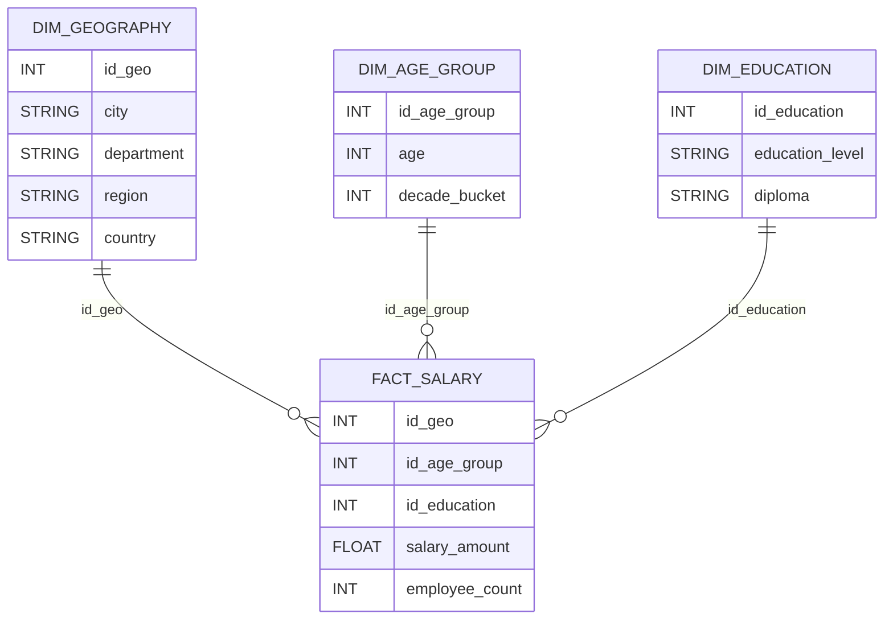

# Cas d’étude 2 — Analyse des salaires

## Q1 — schéma relationnel



## Q2 — Quelle est la table des faits ?

👉 **Table des faits : `FACT_SALARY`**
Elle représente l’événement/observation analysée : **un ensemble de salaires** (au grain défini par Âge × Études × Géographie).

---

## Q3 — Quels sont les faits (mesures) ?

Mesures typiques pour cette analyse :

| Mesure           | Type | Agrégation                  |
| ---------------- | ---- | --------------------------- |
| `salary_amount`  | FLOW | `SUM`, `AVG` (selon besoin) |
| `employee_count` | FLOW | `SUM`                       |

💡 Remarque utile :

* si tu veux un “salaire moyen”, tu peux soit stocker directement `avg_salary`, soit le calculer : `SUM(salary_amount) / SUM(employee_count)` (plus robuste).

---

## Q4 — Combien de dimensions et lesquelles ?

👉 **3 dimensions**

| Dimension       | Contenu                                                                     |
| --------------- | --------------------------------------------------------------------------- |
| `DIM_AGE_GROUP` | âge + tranche par décade                                                    |
| `DIM_EDUCATION` | niveau (primaire/secondaire/supérieur) + diplôme (BEPC/Bac/Licence/Master…) |
| `DIM_GEOGRAPHY` | ville → département → région → pays                                         |

---

## Q5 — Hiérarchies des dimensions (dessinez-les)

### Dimension Âge — `DIM_AGE_GROUP`

Deux niveaux possibles (au choix selon l’analyse) :

```
Âge (année) → Décade (tranche de 10 ans)
```

Ex : 14–23, 24–33, …, 64–73.

---

### Dimension Études — `DIM_EDUCATION`

Deux hiérarchies alternatives (selon la question) :

1. Par niveau global :

```
Niveau d’enseignement (primaire → secondaire → supérieur)
```

2. Par diplôme :

```
Diplôme (CFEP → BEPC → Bac → Licence → Master)
```

*(On peut considérer “diplôme” comme plus fin / plus détaillé que “niveau”, mais ce sont surtout deux axes alternatifs.)*

---

### Dimension Géographie — `DIM_GEOGRAPHY`

Hiérarchie classique :

```
Ville → Département → Région → Pays
```

---

## Q6 — Cube OLAP en tenant compte des hiérarchies

### Cube (axes)

* Axe 1 : **Âge** (année ↔ décade)
* Axe 2 : **Études** (niveau ↔ diplôme)
* Axe 3 : **Géographie** (ville ↔ département ↔ région ↔ pays)

### Mesures dans le cube

* `salary_amount`
* `employee_count`
* éventuellement `avg_salary` (calculé)

### Représentation textuelle

```
CUBE SALARY
  Dimensions:
    - Age: age -> decade
    - Education: level OR diploma
    - Geography: city -> department -> region -> country
  Measures:
    - SUM(salary_amount)
    - SUM(employee_count)
    - AVG salary = SUM(salary_amount) / SUM(employee_count)
```

---
---
---
---
---

> [SUITE DU RENDU ICI](https://github.com/ChristianPRO1982/DI10-Inter-IU_ARA-HDF_Data-Eng_148635_ALT/blob/main/TD/Cas%20d%E2%80%99%C3%A9tude%203%20%E2%80%94%20Du%20relationnel%20au%20d%C3%A9cisionnel%20(%C3%A9toile%20puis%20flocon).md)