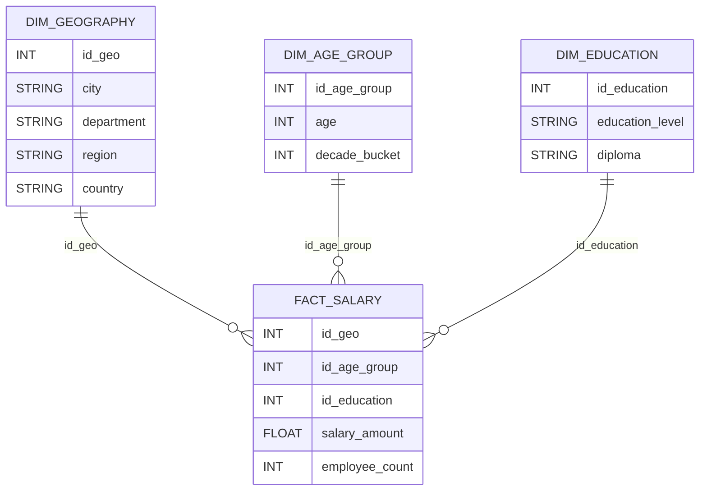

# Cas d’étude 2 — Analyse des salaires

## Q1 — schéma relationnel

```mermaid
erDiagram
  FACT_SALARY {
    INT id_geo
    INT id_age_group
    INT id_education
    FLOAT salary_amount
    INT employee_count
  }

  DIM_GEOGRAPHY {
    INT id_geo
    STRING city
    STRING department
    STRING region
    STRING country
  }

  DIM_AGE_GROUP {
    INT id_age_group
    INT age
    INT decade_bucket
  }

  DIM_EDUCATION {
    INT id_education
    STRING education_level
    STRING diploma
  }

  DIM_GEOGRAPHY ||--o{ FACT_SALARY : "id_geo"
  DIM_AGE_GROUP ||--o{ FACT_SALARY : "id_age_group"
  DIM_EDUCATION ||--o{ FACT_SALARY : "id_education"

```