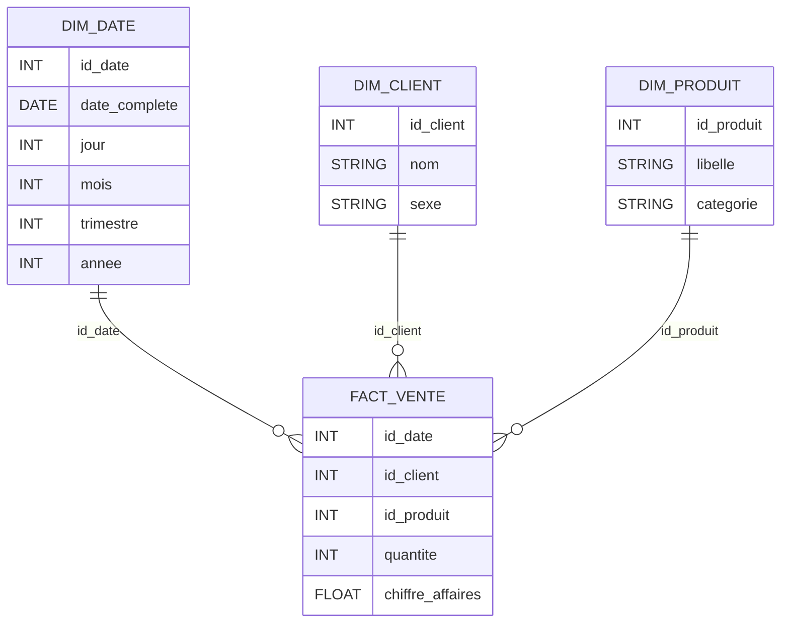
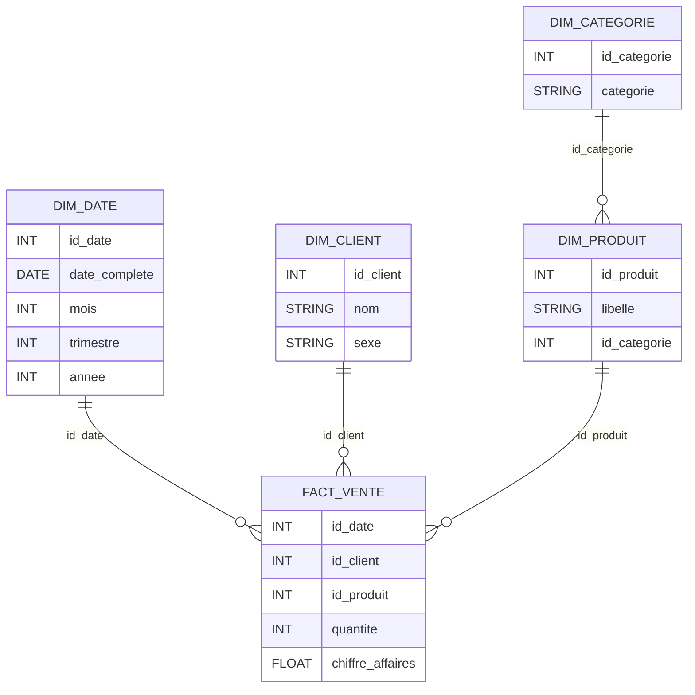

# Cas d’étude 3 — Du relationnel au décisionnel (étoile puis flocon)

## Q1 — Identifier le fait

### 🔹 Événement métier principal

👉 **La vente d’un produit à un client à une date donnée**
(concrètement : une **ligne de commande**).

---

### 🔹 Existe-t-il déjà une table de faits ?

❌ **Non**.

* `COMMANDE` est trop agrégée (une commande peut contenir plusieurs produits)
* `DETAIL_COMMANDE` n’a pas la date ni le client directement

👉 Il faut **construire** la table de faits.

---

### 🔹 À partir de quelles tables construire la table de faits ?

À partir de :

* `DETAIL_COMMANDE`
* `COMMANDE` (pour la date et le client)
* `PRODUIT` (pour le prix / catégorie si nécessaire)

---

### 🔹 Granularité du fait

👉 **Une ligne de commande**, c’est-à-dire :

> la vente d’un produit donné, dans une commande donnée, à un client donné, à une date donnée.

---

## Q2 — Proposer la table de faits

### ⭐ Table de faits : `FACT_VENTE`

| Colonne          | Rôle                              |
| ---------------- | --------------------------------- |
| id_date          | FK vers DIM_DATE                  |
| id_client        | FK vers DIM_CLIENT                |
| id_produit       | FK vers DIM_PRODUIT               |
| quantite         | mesure                            |
| chiffre_affaires | mesure (quantite × prix_unitaire) |

---

## Q3 — Identifier les mesures et les dimensions

### 🔹 Mesures (faits)

| Mesure             | Type | Agrégation |
| ------------------ | ---- | ---------- |
| `quantite`         | FLOW | `SUM`      |
| `chiffre_affaires` | FLOW | `SUM`      |

---

### 🔹 Dimensions

| Dimension     | Rôle               |
| ------------- | ------------------ |
| `DIM_DATE`    | analyse temporelle |
| `DIM_CLIENT`  | analyse client     |
| `DIM_PRODUIT` | analyse produit    |

👉 **3 dimensions**, c’est exactement ce qu’on attend ici.

---

## Q4 — Proposer un schéma en étoile

### ⭐ Schéma en étoile (Mermaid)

✔️ Simple
✔️ Lisible
✔️ Très performant pour l’analyse

---

## Q5 — Proposer un schéma en flocon

### 🔹 Dimension à normaliser

👉 **DIM_PRODUIT**, via l’attribut `categorie`.

---

### ❄️ Schéma en flocon (Mermaid)

---

### 🔹 Ce que l’on gagne avec le flocon

✅ Moins de redondance
✅ Meilleure normalisation
✅ Maintenance facilitée des référentiels

---

### 🔹 Ce que l’on perd

❌ Requêtes plus complexes
❌ Plus de jointures
❌ Performances analytiques légèrement inférieures

👉 **En pratique BI / DW moderne :**

* **Étoile** privilégiée pour la performance
* **Flocon** utilisé quand les dimensions sont très volumineuses ou fortement normalisées

---

## ✅ Verdict Cas 3

✔️ Fait bien identifié
✔️ Granularité correcte
✔️ Étoile et flocon maîtrisés
✔️ Argumentation claire (gains / pertes)
